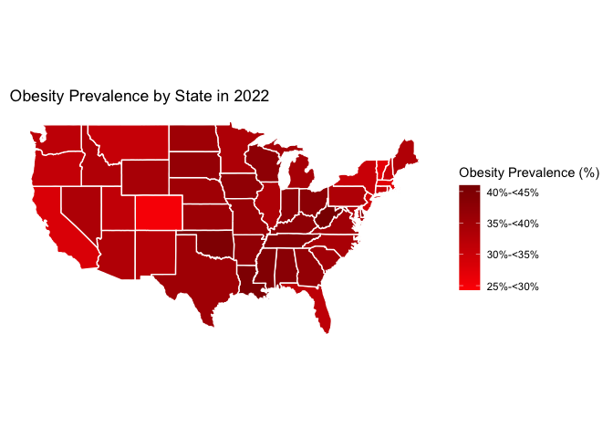
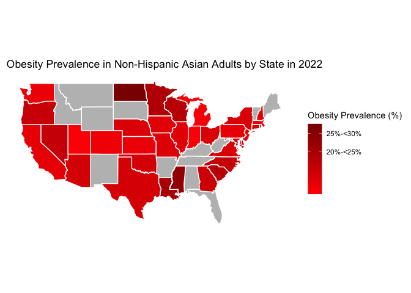
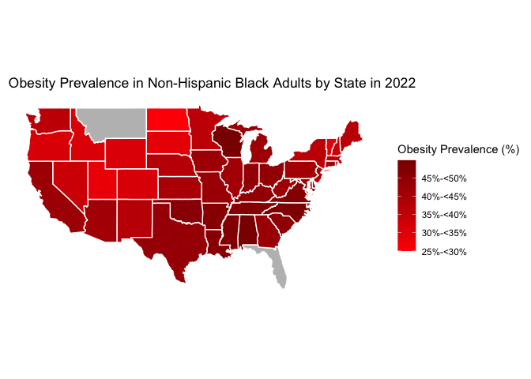
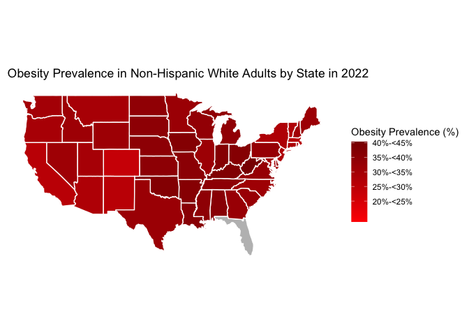
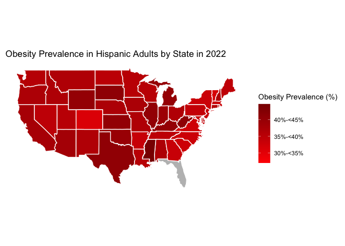

BRFSS Analysis
================
All Group Member Collaboration
2023-11-28

# Data Import

``` r
overall <- read_csv("data/BRFSS/2022-overall-prevalence.csv")
```

    ## Rows: 54 Columns: 3
    ## ── Column specification ────────────────────────────────────────────────────────
    ## Delimiter: ","
    ## chr (2): State, 95% CI
    ## dbl (1): Prevalence
    ## 
    ## ℹ Use `spec()` to retrieve the full column specification for this data.
    ## ℹ Specify the column types or set `show_col_types = FALSE` to quiet this message.

``` r
asian <- read_csv("data/BRFSS/2022-asian.csv")
```

    ## Rows: 54 Columns: 3
    ## ── Column specification ────────────────────────────────────────────────────────
    ## Delimiter: ","
    ## chr (3): State, Prevalence, 95% CI
    ## 
    ## ℹ Use `spec()` to retrieve the full column specification for this data.
    ## ℹ Specify the column types or set `show_col_types = FALSE` to quiet this message.

``` r
black <- read_csv("data/BRFSS/2022-black.csv")
```

    ## Rows: 54 Columns: 3
    ## ── Column specification ────────────────────────────────────────────────────────
    ## Delimiter: ","
    ## chr (3): State, Prevalence, 95% CI
    ## 
    ## ℹ Use `spec()` to retrieve the full column specification for this data.
    ## ℹ Specify the column types or set `show_col_types = FALSE` to quiet this message.

``` r
white <- read_csv("data/BRFSS/2022-white.csv")
```

    ## Rows: 54 Columns: 3
    ## ── Column specification ────────────────────────────────────────────────────────
    ## Delimiter: ","
    ## chr (3): State, Prevalence, 95% CI
    ## 
    ## ℹ Use `spec()` to retrieve the full column specification for this data.
    ## ℹ Specify the column types or set `show_col_types = FALSE` to quiet this message.

``` r
hispanic <- read_csv("data/BRFSS/2022-hispanic.csv")
```

    ## Rows: 54 Columns: 3
    ## ── Column specification ────────────────────────────────────────────────────────
    ## Delimiter: ","
    ## chr (3): State, Prevalence, 95% CI
    ## 
    ## ℹ Use `spec()` to retrieve the full column specification for this data.
    ## ℹ Specify the column types or set `show_col_types = FALSE` to quiet this message.

``` r
states_map <- map_data("state")
states_sf <- st_as_sf(maps::map("state", plot = FALSE, fill = TRUE))
```

# Maps

## Overall Obesity

``` r
overall <- overall %>%
  mutate(State = tolower(State))

overall_map <- left_join(states_map, overall, by = c("region" = "State"))

breaks <- c(0, 20, 25, 30, 35, 40, 45, 50)

ggplot(data = overall_map) +
  geom_polygon(aes(x = long, y = lat, group = group, fill = Prevalence), color = "white") +
  scale_fill_continuous(
    name = "Obesity Prevalence (%)",
    breaks = breaks, 
    labels = c("<20%", "20%-<25%", "25%-<30%", "30%-<35%", 
               "35%-<40%", "40%-<45%", "45%-<50%", "50%+"),
    low = "red", high = "darkred", na.value = "grey"
  ) +
  coord_fixed(1.3) +
  theme_minimal() +
  labs(title = "Obesity Prevalence by State in 2022") +
  theme(legend.position = "right",
        panel.grid.major = element_blank(),  
        panel.grid.minor = element_blank(), 
        axis.text.x = element_blank(), 
        axis.text.y = element_blank(),  
        axis.ticks = element_blank(),
        axis.title.x = element_blank(),
        axis.title.y = element_blank())
```

<!-- -->

## Maps: Obesity by Race/Ethnicity - Non-Hispanic Asian Adults

``` r
asian <- asian %>%
  mutate(State = tolower(State))
asian_map <- left_join(states_map, asian, by = c("region" = "State"))
asian_map <- asian_map %>%
  mutate(Prevalence = as.numeric(as.character(Prevalence)))
```

    ## Warning: There was 1 warning in `mutate()`.
    ## ℹ In argument: `Prevalence = as.numeric(as.character(Prevalence))`.
    ## Caused by warning:
    ## ! NAs introduced by coercion

``` r
breaks <- c(0, 20, 25, 30, 35, 40, 45, 50)
ggplot(data = asian_map) +
  geom_polygon(aes(x = long, y = lat, group = group, fill = Prevalence), color = "white") +
  scale_fill_continuous(
    name = "Obesity Prevalence (%)",
    breaks = breaks, 
    labels = c("<20%", "20%-<25%", "25%-<30%", "30%-<35%", 
               "35%-<40%", "40%-<45%", "45%-<50%", "50%+"),
    low = "red", high = "darkred", na.value = "grey"
  ) +
  coord_fixed(1.3) +
  theme_minimal() +
  labs(title = "Obesity Prevalence in Non-Hispanic Asian Adults by State in 2022") +
  theme(legend.position = "right",
        panel.grid.major = element_blank(),  
        panel.grid.minor = element_blank(), 
        axis.text.x = element_blank(), 
        axis.text.y = element_blank(),  
        axis.ticks = element_blank(),
        axis.title.x = element_blank(),
        axis.title.y = element_blank())
```

<!-- -->

## Maps: Obesity by Race/Ethnicity - Non-Hispanic Black Adults

``` r
black <- black %>%
  mutate(State = tolower(State))
black_map <- left_join(states_map, black, by = c("region" = "State"))
black_map <- black_map %>%
  mutate(Prevalence = as.numeric(as.character(Prevalence)))
```

    ## Warning: There was 1 warning in `mutate()`.
    ## ℹ In argument: `Prevalence = as.numeric(as.character(Prevalence))`.
    ## Caused by warning:
    ## ! NAs introduced by coercion

``` r
breaks <- c(0, 20, 25, 30, 35, 40, 45, 50)
ggplot(data = black_map) +
  geom_polygon(aes(x = long, y = lat, group = group, fill = Prevalence), color = "white") +
  scale_fill_continuous(
    name = "Obesity Prevalence (%)",
    breaks = breaks, 
    labels = c("<20%", "20%-<25%", "25%-<30%", "30%-<35%", 
               "35%-<40%", "40%-<45%", "45%-<50%", "50%+"),
    low = "red", high = "darkred", na.value = "grey"
  ) +
  coord_fixed(1.3) +
  theme_minimal() +
  labs(title = "Obesity Prevalence in Non-Hispanic Black Adults by State in 2022") +
  theme(legend.position = "right",
        panel.grid.major = element_blank(),  
        panel.grid.minor = element_blank(), 
        axis.text.x = element_blank(), 
        axis.text.y = element_blank(),  
        axis.ticks = element_blank(),
        axis.title.x = element_blank(),
        axis.title.y = element_blank())
```

<!-- -->

## Maps: Obesity by Race/Ethnicity - Non-Hispanic White Adults

``` r
white <- white %>%
  mutate(State = tolower(State))
white_map <- left_join(states_map, white, by = c("region" = "State"))
white_map <- white_map %>%
  mutate(Prevalence = as.numeric(as.character(Prevalence)))
```

    ## Warning: There was 1 warning in `mutate()`.
    ## ℹ In argument: `Prevalence = as.numeric(as.character(Prevalence))`.
    ## Caused by warning:
    ## ! NAs introduced by coercion

``` r
breaks <- c(0, 20, 25, 30, 35, 40, 45, 50)
ggplot(data = white_map) +
  geom_polygon(aes(x = long, y = lat, group = group, fill = Prevalence), color = "white") +
  scale_fill_continuous(
    name = "Obesity Prevalence (%)",
    breaks = breaks, 
    labels = c("<20%", "20%-<25%", "25%-<30%", "30%-<35%", 
               "35%-<40%", "40%-<45%", "45%-<50%", "50%+"),
    low = "red", high = "darkred", na.value = "grey"
  ) +
  coord_fixed(1.3) +
  theme_minimal() +
  labs(title = "Obesity Prevalence in Non-Hispanic White Adults by State in 2022") +
  theme(legend.position = "right",
        panel.grid.major = element_blank(),  
        panel.grid.minor = element_blank(), 
        axis.text.x = element_blank(), 
        axis.text.y = element_blank(),  
        axis.ticks = element_blank(),
        axis.title.x = element_blank(),
        axis.title.y = element_blank())
```

<!-- -->

## Maps: Obesity by Race/Ethnicity - Hispanic Adults

``` r
hispanic <- hispanic %>%
  mutate(State = tolower(State))
hispanic_map <- left_join(states_map, hispanic, by = c("region" = "State"))
hispanic_map <- hispanic_map %>%
  mutate(Prevalence = as.numeric(as.character(Prevalence)))
```

    ## Warning: There was 1 warning in `mutate()`.
    ## ℹ In argument: `Prevalence = as.numeric(as.character(Prevalence))`.
    ## Caused by warning:
    ## ! NAs introduced by coercion

``` r
breaks <- c(0, 20, 25, 30, 35, 40, 45, 50)
ggplot(data = hispanic_map) +
  geom_polygon(aes(x = long, y = lat, group = group, fill = Prevalence), color = "white") +
  scale_fill_continuous(
    name = "Obesity Prevalence (%)",
    breaks = breaks, 
    labels = c("<20%", "20%-<25%", "25%-<30%", "30%-<35%", 
               "35%-<40%", "40%-<45%", "45%-<50%", "50%+"),
    low = "red", high = "darkred", na.value = "grey"
  ) +
  coord_fixed(1.3) +
  theme_minimal() +
  labs(title = "Obesity Prevalence in Hispanic Adults by State in 2022") +
  theme(legend.position = "right",
        panel.grid.major = element_blank(),  
        panel.grid.minor = element_blank(), 
        axis.text.x = element_blank(), 
        axis.text.y = element_blank(),  
        axis.ticks = element_blank(),
        axis.title.x = element_blank(),
        axis.title.y = element_blank())
```

<!-- -->
