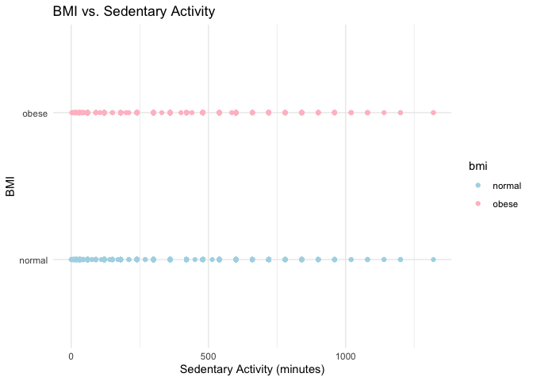

P8105 Fall 2023 Final Project Proposal
================
All Group Member Collaboration
2023-11-10

### Group Members

- Yuandi Gao (yg2907)
- Yi Li (yl5214)
- Yingting Zhang (yz4434)
- Ruohan Hong (rh3132)
- Shiqi Wu (sw3737)

## Import data from NHANES

``` r
import_df= function(path){
  read_xpt(path)
}
obesity=
  import_df(path='data/P_BMX.XPT') |> 
  full_join((import_df(path='data/P_DEMO.XPT')), by='SEQN') |>
  full_join((import_df(path='data/P_PAQ.XPT')), by='SEQN')|>
  full_join ((import_df(path='data/P_DBQ.XPT')), by='SEQN') |> 
  select (SEQN,RIAGENDR,RIDAGEYR,DMDMARTZ,INDFMPIR,RIDRETH3,DMDEDUC2,PAD680,BMXBMI,DBD900,DBD910) |> 
  filter(
    !(DMDMARTZ %in% c('77','99','.') ),
    !(INDFMPIR == '.'),
    !(DMDEDUC2 %in% c('7','9','.') ),
    !(PAD680 %in% c('7777', '9999', '.')),
    !(BMXBMI =='.'),
    !(DBD900 %in% c('7777', '9999', '.')),
    !(DBD910 %in% c('7777', '9999', '.'))
  ) |> 
  rename(
    gender=RIAGENDR,
    age=RIDAGEYR,
    marital_status=DMDMARTZ,
    income_to_poverty=INDFMPIR,
    race=RIDRETH3,
    education=DMDEDUC2,
    sedentary_activity=PAD680,
    bmi=BMXBMI,
    freq_fast_food=DBD900,
    freq_frozen=DBD910
  ) |> 
  mutate(
    gender = case_match(
      gender,
      1~"Male",
      2~"Female"),
    gender = as.factor(gender),
  marital_status= case_match(
    marital_status,
      1~"Married",
      2~"Widowed/Divorced/Separated",
      3~"Never married"
  ),
    race= case_match(
    race,
      1~"Mexican American",
      2~"Other Hispanic",
      3~"White",
      4~"Black",
      5~"Asian",
      6~"Other"
     ),
      education= case_match(
    education,
      1~"Less than 9th grade",
      2~"9-11th grade",
      3~"High school graduate" ,
      4~"Some college or AA degree",
      6~"College graduate or above"
     ),
   bmi =case_when(
    bmi<30 ~ 'normal',
    bmi>=30 ~'obese'
  )
  )
```

## Graphs

### Bar Chart of Obesity Prevalence by Race and Gender

``` r
obesity_race_filtered = obesity |>  
  filter(!is.na(race) & race != "NA")

ggplot(obesity_race_filtered, aes(x = race, fill = gender)) +
  geom_bar(position = "dodge") +
  scale_fill_manual(values = c("pink", "lightblue")) +
  labs(title = "Obesity Prevalence by Race and Gender",
       x = "Race",
       y = "Count") +
  theme_minimal()
```

<!-- -->

Interpretation: The bar chart displays the prevalence of obesity across
different racial categories, differentiated by gender. It shows that the
White population has the highest count of obesity cases, with a notable
number of cases in both genders. The Black population follows, with
females being higher than males, whereas the “Other Hispanic” categories
have the lowest count of obesity cases.

### Histogram of Age Distribution Among Obese Individuals

``` r
ggplot(subset(obesity, bmi == "obese"), aes(x = age)) +
  geom_histogram(binwidth = 1, fill = "pink", color = "lightblue") +
  labs(title = "Age Distribution of Obese Individuals",
       x = "Age",
       y = "Count") +
  theme_minimal()
```

<!-- -->

Interpretation: The histogram indicates that obesity is present across
all age groups, with a relatively uniform distribution from young
adulthood to late middle age. There’s a significant peak in obesity
cases among individuals in their late 50s to early 60s. After this peak,
the number of obese individuals declines sharply for those in the older
age groups.

### Box Plot of Income to Poverty Ratio for Obese Individuals

``` r
ggplot(subset(obesity, bmi == "obese"), aes(y = income_to_poverty, x = "", fill = bmi)) +
  geom_boxplot() +
  scale_fill_manual(values = c("pink")) +
  labs(title = "Income to Poverty Ratio Among Obese Individuals",
       x = "",
       y = "Income to Poverty Ratio") +
  theme_minimal()
```

<!-- -->

Interpretation: The box plot shows the distribution of the income to
poverty ratio among obese individuals. The data is spread across a range
of ratios, mostly concentrated between 1 and 4, with the median around
2. This suggests that individuals with obesity come from a range of
economic backgrounds, but there’s a tendency towards lower income to
poverty ratios.

### Scatter Plot of BMI vs. Sedentary Activity

``` r
obesity_sedentary_activity_filtered = obesity |> 
  filter(!is.na(sedentary_activity))

ggplot(obesity_sedentary_activity_filtered, aes(x = sedentary_activity, y = bmi, color = bmi)) +
  geom_point() +
  scale_color_manual(values = c("normal" = "lightblue", "obese" = "pink")) +
  labs(title = "BMI vs. Sedentary Activity",
       x = "Sedentary Activity (minutes)",
       y = "BMI") +
  theme_minimal()
```

<!-- -->

Interpretation: The scatter plot presents a comparison of sedentary
activity (in minutes) with BMI categories (normal and obese). Points are
relatively evenly distributed across the range of sedentary activity for
both BMI categories, suggesting no clear or immediate correlation
between the amount of sedentary activity and BMI category within this
dataset. It indicates that individuals classified as obese and those
with a normal BMI report similar patterns of sedentary behavior.

### Heat Map of Fast Food and Frozen Meal Consumption

``` r
aggregated_data = obesity |> 
  group_by(age, gender) |> 
  summarize(avg_fast_food = mean(freq_fast_food, na.rm = TRUE),
            avg_frozen_food = mean(freq_frozen, na.rm = TRUE))
```

    ## `summarise()` has grouped output by 'age'. You can override using the `.groups`
    ## argument.

``` r
melted_data = melt(aggregated_data, id.vars = c("age", "gender"))

ggplot(melted_data, aes(x = age, y = variable, fill = value)) +
  geom_tile() +
  scale_fill_gradient(low = "lightblue", high = "pink") +
  labs(title = "Heat Map of Fast Food and Frozen Meal Consumption",
       x = "Age",
       y = "Food Type",
       fill = "Average Consumption") +
  theme_minimal()
```

<!-- -->

Interpretation：The heat map shows the average consumption of fast food
and frozen meals across different ages. Consumption levels are indicated
by the color intensity, with darker shades of pink representing higher
consumption. From the visualization, it appears that there are specific
age groups that consume fast food and frozen meals more frequently, as
indicated by the vertical pink bars, which suggest peaks in consumption
at those ages.

### Baseline characterics

``` r
library(dplyr)
library(readxl)
```

``` r
gender_summary <- obesity %>%
  count(gender) %>%
  mutate(Percentage = n / sum(n) * 100)

print(gender_summary)
```

    ## # A tibble: 2 × 3
    ##   gender     n Percentage
    ##   <fct>  <int>      <dbl>
    ## 1 Female  5800       50.9
    ## 2 Male    5588       49.1

``` r
marital_status_summary <- obesity %>%
  count(marital_status) %>%
  mutate(Percentage = n / sum(n) * 100)
print(marital_status_summary)
```

    ## # A tibble: 4 × 3
    ##   marital_status                 n Percentage
    ##   <chr>                      <int>      <dbl>
    ## 1 Married                     4216       37.0
    ## 2 Never married               1360       11.9
    ## 3 Widowed/Divorced/Separated  1599       14.0
    ## 4 <NA>                        4213       37.0

``` r
age_summary <- obesity %>%
  summarise(
    Count = n(),
    Unique = n_distinct(age),
    Mean = mean(age, na.rm = TRUE),
    Std_Dev = sd(age, na.rm = TRUE),
    Min = min(age, na.rm = TRUE),
    `25th_Pctl` = quantile(age, 0.25, na.rm = TRUE),
    Median = median(age, na.rm = TRUE),
    `75th_Pctl` = quantile(age, 0.75, na.rm = TRUE),
    Max = max(age, na.rm = TRUE)
  )

print(age_summary)
```

    ## # A tibble: 1 × 9
    ##   Count Unique  Mean Std_Dev   Min `25th_Pctl` Median `75th_Pctl`   Max
    ##   <int>  <int> <dbl>   <dbl> <dbl>       <dbl>  <dbl>       <dbl> <dbl>
    ## 1 11388     79  35.6    24.2     2          13     33          57    80

``` r
income_to_poverty_summary <- obesity %>%
  summarise(
    Count = n(),
    Unique = n_distinct(income_to_poverty),
    Mean = mean(income_to_poverty, na.rm = TRUE),
    Std_Dev = sd(income_to_poverty, na.rm = TRUE),
    Min = min(income_to_poverty, na.rm = TRUE),
    `25th_Pctl` = quantile(income_to_poverty, 0.25, na.rm = TRUE),
    Median = median(income_to_poverty, na.rm = TRUE),
    `75th_Pctl` = quantile(income_to_poverty, 0.75, na.rm = TRUE),
    Max = max(income_to_poverty, na.rm = TRUE)
  )

print(income_to_poverty_summary)
```

    ## # A tibble: 1 × 9
    ##   Count Unique  Mean Std_Dev   Min `25th_Pctl` Median `75th_Pctl`   Max
    ##   <int>  <int> <dbl>   <dbl> <dbl>       <dbl>  <dbl>       <dbl> <dbl>
    ## 1 11388    472  2.42    1.63     0        1.04   1.99        3.90     5

``` r
education_summary <- obesity %>%
  count(education) %>%
  mutate(Percentage = n / sum(n) * 100)

print(education_summary)
```

    ## # A tibble: 5 × 3
    ##   education                     n Percentage
    ##   <chr>                     <int>      <dbl>
    ## 1 9-11th grade                763       6.70
    ## 2 High school graduate       1722      15.1 
    ## 3 Less than 9th grade         475       4.17
    ## 4 Some college or AA degree  2406      21.1 
    ## 5 <NA>                       6022      52.9

``` r
race_summary <- obesity %>%
  count(race) %>%
  mutate(Percentage = n / sum(n) * 100)

print(race_summary)
```

    ## # A tibble: 6 × 3
    ##   race                 n Percentage
    ##   <chr>            <int>      <dbl>
    ## 1 Black             2970      26.1 
    ## 2 Mexican American  1397      12.3 
    ## 3 Other             1217      10.7 
    ## 4 Other Hispanic    1050       9.22
    ## 5 White             3995      35.1 
    ## 6 <NA>               759       6.66

What’s left for baseline: sedentary_activit, BMI, freq_fast_food,
freq_frozen

``` r
sedentary_activity_summary <- obesity %>%
  summarise(
    Count = n(),
    Mean = mean(sedentary_activity, na.rm = TRUE),
    Std_Dev = sd(sedentary_activity, na.rm = TRUE),
    Min = min(sedentary_activity, na.rm = TRUE),
    `25th_Pctl` = quantile(sedentary_activity, 0.25, na.rm = TRUE),
    Median = median(sedentary_activity, na.rm = TRUE),
    `75th_Pctl` = quantile(sedentary_activity, 0.75, na.rm = TRUE),
    Max = max(sedentary_activity, na.rm = TRUE)
  )
print(sedentary_activity_summary)
```

    ## # A tibble: 1 × 8
    ##   Count  Mean Std_Dev   Min `25th_Pctl` Median `75th_Pctl`   Max
    ##   <int> <dbl>   <dbl> <dbl>       <dbl>  <dbl>       <dbl> <dbl>
    ## 1 11388  338.    203.     0         180    300         480  1320

``` r
bmi_summary <- obesity %>%
  count(bmi) %>%
  mutate(Percentage = n / sum(n) * 100)
print(bmi_summary)
```

    ## # A tibble: 2 × 3
    ##   bmi        n Percentage
    ##   <chr>  <int>      <dbl>
    ## 1 normal  7922       69.6
    ## 2 obese   3466       30.4

``` r
fast_food_summary <- obesity %>%
  group_by(gender, age) %>%
  summarise(Avg_Fast_Food = mean(freq_fast_food, na.rm = TRUE))
```

    ## `summarise()` has grouped output by 'gender'. You can override using the
    ## `.groups` argument.

``` r
print(fast_food_summary)
```

    ## # A tibble: 158 × 3
    ## # Groups:   gender [2]
    ##    gender   age Avg_Fast_Food
    ##    <fct>  <dbl>         <dbl>
    ##  1 Female     2          1.66
    ##  2 Female     3          1.78
    ##  3 Female     4          1.40
    ##  4 Female     5          1.42
    ##  5 Female     6          1.79
    ##  6 Female     7          1.67
    ##  7 Female     8          1.77
    ##  8 Female     9          1.81
    ##  9 Female    10          2.01
    ## 10 Female    11          1.70
    ## # ℹ 148 more rows

``` r
frozen_food_summary <- obesity %>%
  group_by(gender, age) %>%
  summarise(Avg_Frozen_Food = mean(freq_frozen, na.rm = TRUE))
```

    ## `summarise()` has grouped output by 'gender'. You can override using the
    ## `.groups` argument.

``` r
print(frozen_food_summary)
```

    ## # A tibble: 158 × 3
    ## # Groups:   gender [2]
    ##    gender   age Avg_Frozen_Food
    ##    <fct>  <dbl>           <dbl>
    ##  1 Female     2            2.48
    ##  2 Female     3            2.32
    ##  3 Female     4            2.70
    ##  4 Female     5            2.96
    ##  5 Female     6            2.44
    ##  6 Female     7            2.37
    ##  7 Female     8            2.51
    ##  8 Female     9           52.0 
    ##  9 Female    10            2.08
    ## 10 Female    11            3.02
    ## # ℹ 148 more rows
