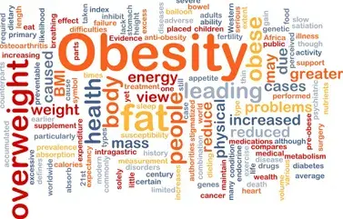

## Our Motivation

The increasing prevalence of obesity cases in the United States is becoming a serious public health issue and bringing up lots of adverse comorbidities. The problem that comes with obesity exists not just on an individual level but is more troublesome as it can lead to substantial effects on the overall healthcare system's performance and affect economies across the country. When we talk about obesity nowadays, we can not stop thinking of the burden that associated with it. According to a National Survey published by Forbes Health, between 2017 and 2020, around 41.9% of adults in the United States were obese.

With almost half of the adults being obese, Obesity was considered a national epidemic. Concerns like chronic diseases, type 2 diabetes, cardiovascular conditions, and certain forms of cancer, that are linked with obesity, can easily lead to heightened mortality rates and diminished quality of life. The causes of obesity are diverse and complex, involving genetics, societal, and environmental factors but addressing this public health problem and educating the importance of personal wellness among the obese population in the U.S. is in urgent need.

