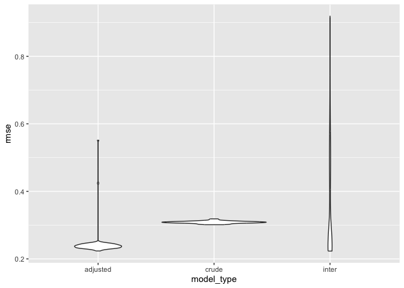

P8105 Fall 2023 Final Project Proposal
================
All Group Member Collaboration
2023-12-07

### Group Members

- Yuandi Gao (yg2907)
- Yi Li (yl5214)
- Yingting Zhang (yz4434)
- Ruohan Hong (rh3132)
- Shiqi Wu (sw3737)

## Import data from NHANES

``` r
import_df= function(path){
  read_xpt(path)
}
obesity=
  import_df(path='data/P_BMX.XPT') |> 
  full_join((import_df(path='data/P_DEMO.XPT')), by='SEQN') |>
  full_join((import_df(path='data/P_PAQ.XPT')), by='SEQN')|>
  full_join ((import_df(path='data/P_DBQ.XPT')), by='SEQN') |> 
  select (SEQN,RIAGENDR,RIDAGEYR,DMDMARTZ,INDFMPIR,RIDRETH3,DMDEDUC2,PAD680,BMXBMI,DBD900,DBD910) |> 
  filter(
    !(DMDMARTZ %in% c('77','99','.') ),
    !(INDFMPIR == '.'),
    !(DMDEDUC2 %in% c('7','9','.') ),
    !(PAD680 %in% c('7777', '9999', '.')),
    !(BMXBMI =='.'),
    !(DBD900 %in% c('7777', '9999', '.')),
    !(DBD910 %in% c('7777', '9999', '.'))
  ) |> 
  rename(
    gender=RIAGENDR,
    age=RIDAGEYR,
    marital_status=DMDMARTZ,
    income_to_poverty=INDFMPIR,
    race=RIDRETH3,
    education=DMDEDUC2,
    sedentary_activity=PAD680,
    bmi=BMXBMI,
    freq_fast_food=DBD900,
    freq_frozen=DBD910
  ) |> 
  mutate(
    gender = case_match(
      gender,
      1~"Male",
      2~"Female"),
    gender = as.factor(gender),
  marital_status= case_match(
    marital_status,
      1~"Married",
      2~"Widowed/Divorced/Separated",
      3~"Never married"
  ),
    race= case_match(
    race,
      1~"Mexican American",
      2~"Other Hispanic",
      3~"White",
      4~"Black",
      5~"Asian",
      6~"Other"
     ),
      education= case_match(
    education,
      1~"Less than 9th grade",
      2~"9-11th grade",
      3~"High school graduate" ,
      4~"Some college or AA degree",
      6~"College graduate or above"
     ),
   obese =case_when(
    bmi<30 ~ 'normal',
    bmi>=30 ~'obese'
  )
  )
```

``` r
# Histogram for BMI
ggplot(obesity, aes(x = bmi)) + 
  geom_histogram(binwidth = 1, fill = "blue", color = "black") + 
  labs(title = "Distribution of BMI", x = "BMI", y = "Count") + 
  theme_minimal()
```

<!-- -->

``` r
# Density plot for BMI
ggplot(obesity, aes(x = bmi)) + 
  geom_density(fill = "blue", alpha = 0.5) + 
  labs(title = "Density Plot for BMI", x = "BMI", y = "Density") + 
  theme_minimal()
```

<!-- -->

``` r
# Boxplot for BMI
ggplot(obesity, aes(y = bmi, x = 1)) + 
  geom_boxplot(fill = "blue", alpha = 0.5) + 
  labs(title = "Boxplot for BMI", x = "", y = "BMI") + 
  theme_minimal()
```

<!-- -->

The histogram and density plot indicate that the distribution of `BMI`
is right-skewed, which is a common observation in health-related data.

When the response variable in a regression model, BMI, in our case, is
not normally distributed, we took a common approach is to apply a
transformation to achieve normality. The logarithmic transformation is
particularly useful because it is a monotonic transformation that can
handle positive skewness by compressing the long tail and expanding the
lower end of the distribution. This can make the distribution more
symmetric and more closely approximate the normal distribution, which
meets the assumptions of linear regression.

By transforming `BMI` using the natural logarithm, we can stabilize the
variance (homoscedasticity) and make the relationship between the
predictors and the response variable more linear. This is beneficial
because linear regression assumes a linear relationship between the
predictors and the outcome variable.

## Cross-Validation and Model Comparison for Predicting BMI Based on Fast Food Frequency

First, we compare the three models for predictor fast food frequency

``` r
cv_df = 
  obesity |> 
  crossv_mc(n = 100) |> 
  mutate(
    train = map(train, as_tibble),
    test = map(test, as_tibble)
  )
cv_results =
  cv_df |> 
  mutate(
    model_fast_crude = map(train, \(df) lm(log(bmi) ~ freq_fast_food, data = df) ),
    model_fast_adjusted = map(train, \(df) lm(log(bmi) ~ freq_fast_food+age+gender+marital_status+ race+education+income_to_poverty, data = df)),
    model_fast_inter = map(train, \(df) lm(log(bmi) ~ freq_fast_food*education+freq_fast_food*income_to_poverty+freq_fast_food+age+gender+marital_status+ race+education+income_to_poverty, data = df))
  ) |> 
  mutate(
    rmse_fast_crude = map2_dbl(model_fast_crude, test, \(mod, df) rmse(mod, df)),
    rmse_fast_adjusted = map2_dbl(model_fast_adjusted, test, \(mod, df) rmse(mod, df)),
    rmse_fast_inter = map2_dbl(model_fast_inter, test, \(mod, df) rmse(mod, df))
  )
```

# Plot of model comparison of fast food frequency

``` r
cv_results |> 
  select(starts_with("rmse")) |> 
  pivot_longer(
    everything(),
    names_to = "model_type",
    values_to = "rmse",
    names_prefix = "rmse_"
  ) |> 
  group_by(model_type) |> 
  summarize(m_rmse = mean(rmse))
```

    ## # A tibble: 3 × 2
    ##   model_type    m_rmse
    ##   <chr>          <dbl>
    ## 1 fast_adjusted  0.328
    ## 2 fast_crude     0.511
    ## 3 fast_inter     0.349

``` r
cv_results |> 
  select(starts_with("rmse")) |> 
  pivot_longer(
    everything(),
    names_to = "model_type",
    values_to = "rmse",
    names_prefix = "rmse_"
  ) |> 
  ggplot(aes(x = model_type, y = rmse)) +
  geom_violin()
```

<!-- -->

## Interpretion of the fast food frequncy in terms of BMI:

`fast_adjusted` model has a lower median with most of its data
concentrated at the lower end of the rmse scale, which suggests better
predictive performance for most of its predictions compared to the other
models. `fast_crude` model has a wider spread of values, indicating less
consistency in predictive performance. `fast_inter` has most of its data
concentrated at the low end like fast_adjusted, but the long tail
indicates there are also quite a few cases where its predictions are
much worse. Considering this, `fast_adjusted` seems to be the best model
overall due to its concentration of lower rmse values, although
`fast_inter` may also perform similarly well for the majority of
predictions but has some predictions with high error.

## Interpretation of fast food variable:

For one unit increase in number of meals from fast food or pizza place,
the bmi will decrease by 0.0026 kg/m^2, while adjusting for all other
covariate in the model.

## Cross-Validation and Model Comparison for Predicting BMI Based on Fast Food FrequencyBMI and predictor sendendary activity

``` r
# Histogram and Density Plot for Sedentary Activity
ggplot(obesity, aes(x = sedentary_activity)) +
  geom_histogram(binwidth = 10, fill = "green", color = "black", alpha = 0.7) + 
  geom_density(alpha = 0.2, adjust = 1/5) + 
  labs(title = "Distribution of Sedentary Activity", x = "Sedentary Activity", y = "Density") +
  theme_minimal()
```

    ## Warning: Removed 3879 rows containing non-finite values (`stat_bin()`).

    ## Warning: Removed 3879 rows containing non-finite values (`stat_density()`).

<!-- -->

# Step 1: Model building for sedentary activity with log(BMI)

# Step 1: model building

``` r
cv_df_sedentary = 
  obesity |> 
  crossv_mc(n = 100) |> 
  mutate(
    train = map(train, as_tibble),
    test = map(test, as_tibble)
  )

cv_results_sedentary =
  cv_df_sedentary |> 
  mutate(
    model_sed_crude = map(train, \(df) lm(log(bmi) ~ sedentary_activity, data = df)),
    model_sed_adjusted = map(train, \(df) lm(log(bmi) ~ sedentary_activity+age+gender+marital_status+race+education+income_to_poverty, data = df)),
    model_sed_inter = map(train, \(df) lm(log(bmi) ~ sedentary_activity*education+sedentary_activity*income_to_poverty+sedentary_activity+age+gender+marital_status+race+education+income_to_poverty, data = df))
  ) |> 
  mutate(
    rmse_sed_crude = map2_dbl(model_sed_crude, test, \(mod, df) rmse(mod, df)),
    rmse_sed_adjusted = map2_dbl(model_sed_adjusted, test, \(mod, df) rmse(mod, df)),
    rmse_sed_inter = map2_dbl(model_sed_inter, test, \(mod, df) rmse(mod, df))
  )
```

``` r
cv_results_sedentary |> 
  select(starts_with("rmse_sed")) |> 
  pivot_longer(
    everything(),
    names_to = "model_type",
    values_to = "rmse",
    names_prefix = "rmse_sed_"
  ) |> 
  ggplot(aes(x = model_type, y = rmse)) +
  geom_violin()
```

<!-- -->

# Summary of Cross validation Results- sendendary activity

``` r
cv_results_sedentary |> 
  select(starts_with("rmse_sed")) |> 
  pivot_longer(
    everything(),
    names_to = "model_type",
    values_to = "rmse",
    names_prefix = "rmse_sed_"
  ) |> 
  group_by(model_type) |> 
  summarize(m_rmse = mean(rmse))
```

    ## # A tibble: 3 × 2
    ##   model_type m_rmse
    ##   <chr>       <dbl>
    ## 1 adjusted    0.234
    ## 2 crude       0.237
    ## 3 inter       0.234

In the context of these models, a lower RMSE indicates a more accurate
prediction of BMI from the predictors used in the model.

The cross-validation results show that the mean RMSE for the adjusted
and inter (interaction) models are both 0.235, while the crude model has
a slightly higher RMSE of 0.237. In this case, both the adjusted and
inter models perform slightly better than the crude model, as indicated
by their lower RMSE values, which means they are, on average, closer to
the true BMI values when log-transformed.

A valid reason we choose the adjusted model over the inter model,
despite having the same RMSE, could be due to its simplicity and
interpretability. The adjusted model includes additional covariates
(age, gender, marital status, race, education, and income to poverty
ratio) that are expected to be related to BMI based on previous research
or theoretical considerations. Including these covariates allows the
model to account for more variability in BMI that is explained by these
factors.

Moreover, while interaction terms in the inter model may capture the
combined effects of sedentary activity with other variables, they can
make the model more complex and harder to interpret. We proceed the
model statitics in adjusted model for sedentary activity.

``` r
# Extract the summary of the 'adjusted' model
best_model_summary <- cv_results_sedentary$model_sed_adjusted[[1]] %>% summary()

# Print the summary which includes beta coefficients, p-values, etc.
print(best_model_summary)
```

    ## 
    ## Call:
    ## lm(formula = log(bmi) ~ sedentary_activity + age + gender + marital_status + 
    ##     race + education + income_to_poverty, data = df)
    ## 
    ## Residuals:
    ##      Min       1Q   Median       3Q      Max 
    ## -0.73985 -0.15583 -0.00707  0.14567  1.12498 
    ## 
    ## Coefficients:
    ##                                            Estimate Std. Error t value Pr(>|t|)
    ## (Intercept)                               3.381e+00  1.881e-02 179.710  < 2e-16
    ## sedentary_activity                        1.841e-04  1.919e-05   9.595  < 2e-16
    ## age                                       1.306e-04  2.426e-04   0.538  0.59043
    ## genderMale                               -4.650e-02  7.510e-03  -6.192 6.52e-10
    ## marital_statusNever married              -2.829e-02  1.059e-02  -2.672  0.00757
    ## marital_statusWidowed/Divorced/Separated -3.038e-02  9.583e-03  -3.171  0.00153
    ## raceMexican American                      6.086e-04  1.274e-02   0.048  0.96190
    ## raceOther                                -1.795e-01  1.559e-02 -11.513  < 2e-16
    ## raceOther Hispanic                       -1.480e-02  1.342e-02  -1.103  0.27010
    ## raceWhite                                -3.800e-02  9.305e-03  -4.084 4.52e-05
    ## educationHigh school graduate             1.037e-02  1.191e-02   0.871  0.38405
    ## educationLess than 9th grade              2.548e-03  1.610e-02   0.158  0.87429
    ## educationSome college or AA degree        1.225e-02  1.180e-02   1.039  0.29904
    ## income_to_poverty                        -1.051e-03  2.741e-03  -0.383  0.70144
    ##                                             
    ## (Intercept)                              ***
    ## sedentary_activity                       ***
    ## age                                         
    ## genderMale                               ***
    ## marital_statusNever married              ** 
    ## marital_statusWidowed/Divorced/Separated ** 
    ## raceMexican American                        
    ## raceOther                                ***
    ## raceOther Hispanic                          
    ## raceWhite                                ***
    ## educationHigh school graduate               
    ## educationLess than 9th grade                
    ## educationSome college or AA degree          
    ## income_to_poverty                           
    ## ---
    ## Signif. codes:  0 '***' 0.001 '**' 0.01 '*' 0.05 '.' 0.1 ' ' 1
    ## 
    ## Residual standard error: 0.2355 on 4060 degrees of freedom
    ##   (5036 observations deleted due to missingness)
    ## Multiple R-squared:  0.06434,    Adjusted R-squared:  0.06134 
    ## F-statistic: 21.47 on 13 and 4060 DF,  p-value: < 2.2e-16

``` r
# Plotting the 'adjusted' model's fitted values vs. residuals
best_model <- cv_results_sedentary$model_sed_adjusted[[1]]
best_model_residuals <- resid(best_model)
best_model_fitted <- fitted(best_model)

# Create a residuals vs fitted values plot
residual_plot <- ggplot() +
  geom_point(aes(x = best_model_fitted, y = best_model_residuals)) +
  geom_hline(yintercept = 0, linetype = "dashed", color = "red") +
  labs(title = "Residuals vs Fitted Values for Interaction Model",
       x = "Fitted Values",
       y = "Residuals") +
  theme_minimal() +
  geom_smooth(aes(x = best_model_fitted, y = best_model_residuals), method = "loess", se = FALSE)

# Print the residual plot
print(residual_plot)
```

    ## `geom_smooth()` using formula = 'y ~ x'

<!-- -->

## Interpretation of the Adjusted model (activity)

`Coefficients Interpretation on Log Scale`: `Intercept`: The estimated
`log(BMI)` is approximately 3.366 when all predictor variables are held
at zero. To interpret this on the original BMI scale, you would
calculate exp(3.366). This value represents the estimated BMI for the
baseline categories of all categorical predictors (usually the most
common or reference category) and zero for continuous predictors.

`Sedentary Activity`: The coefficient for sedentary activity is positive
(0.0001905) and statistically significant. This suggests that for each
unit increase in sedentary activity, the log(BMI) increases by this
amount. To interpret the effect on the original BMI scale, consider that
a small increase in the `log(BMI)` corresponds to a percentage increase
in BMI. Specifically, a one-unit increase in sedentary activity is
associated with approximately a 0.01905% increase in BMI.

`Other Predictors`: Similarly, for other continuous predictors like age,
the coefficient represents the percentage change in BMI for a one-unit
increase in that predictor. For categorical predictors like gender,
marital status, and race, the coefficients represent the percentage
difference in BMI compared to the reference category.

`Model Fit and R-squared`: The `R-squared` value (0.06851) indicates
that about 6.851% of the variability in log-transformed BMI is explained
by the model. While this might seem low, it’s not uncommon in behavioral
and social science research where many unmeasured factors can influence
the outcome. Statistical Significance:

The significance of the coefficients suggests that these factors have a
statistically significant association with BMI. However, the magnitude
of these effects might be small, especially for variables like age and
income_to_poverty ratio.

Overall Interpretation: The significant predictors in the model, like
`sedentary activity` and `gender`, indicate factors that are associated
with `BMI`. However, the small R-squared value suggests that many other
factors not included in the model also influence `BMI`. Given that the
response variable is log-transformed, the interpretation is in terms of
percentage change (for continuous predictors) or relative percentage
difference (for categorical predictors) in BMI.

# Cross-Validation and Model Comparison for Predicting BMI Based on Frozen Fast Food Frequency

``` r
cv_results =
  cv_df |> 
  mutate(
    model_frozen = map(train, \(df) lm(log(bmi) ~ freq_frozen*education + freq_frozen*income_to_poverty + freq_frozen + age + gender + marital_status + race + education + income_to_poverty, data = df))
  ) |> 
  mutate(
    rmse_frozen = map2_dbl(model_frozen, test, \(mod, df) rmse(mod, df)))
```

# Regression Models and Diagnostics

Model1: log(BMI)=freq_fast

``` r
# Crude model for freq_fast_food
freq_fast_crude = lm(log(bmi) ~ freq_fast_food, data = obesity)

obesity |> modelr::add_residuals(freq_fast_crude) |> 
  ggplot(aes(sample = resid))+stat_qq()+stat_qq_line()
```

    ## Warning: Removed 2345 rows containing non-finite values (`stat_qq()`).

    ## Warning: Removed 2345 rows containing non-finite values (`stat_qq_line()`).

<!-- -->

Model2: log(BMI)=sedentary activity

``` r
# Crude model for inactivity
inactivity_crude = lm(log(bmi) ~ sedentary_activity, data = obesity)

obesity |> modelr::add_residuals(inactivity_crude) |> 
  ggplot(aes(sample = resid))+stat_qq()+stat_qq_line()
```

    ## Warning: Removed 3879 rows containing non-finite values (`stat_qq()`).

    ## Warning: Removed 3879 rows containing non-finite values (`stat_qq_line()`).

<!-- -->

Model3: log(BMI)=freqence of frozen

``` r
# Crude model for freq_frozen
freq_frozen_crude = lm(log(bmi) ~ freq_frozen, data = obesity)


obesity |> modelr::add_residuals(freq_frozen_crude) |> 
  ggplot(aes(sample = resid))+stat_qq()+stat_qq_line()
```

    ## Warning: Removed 38 rows containing non-finite values (`stat_qq()`).

    ## Warning: Removed 38 rows containing non-finite values (`stat_qq_line()`).

<!-- -->
